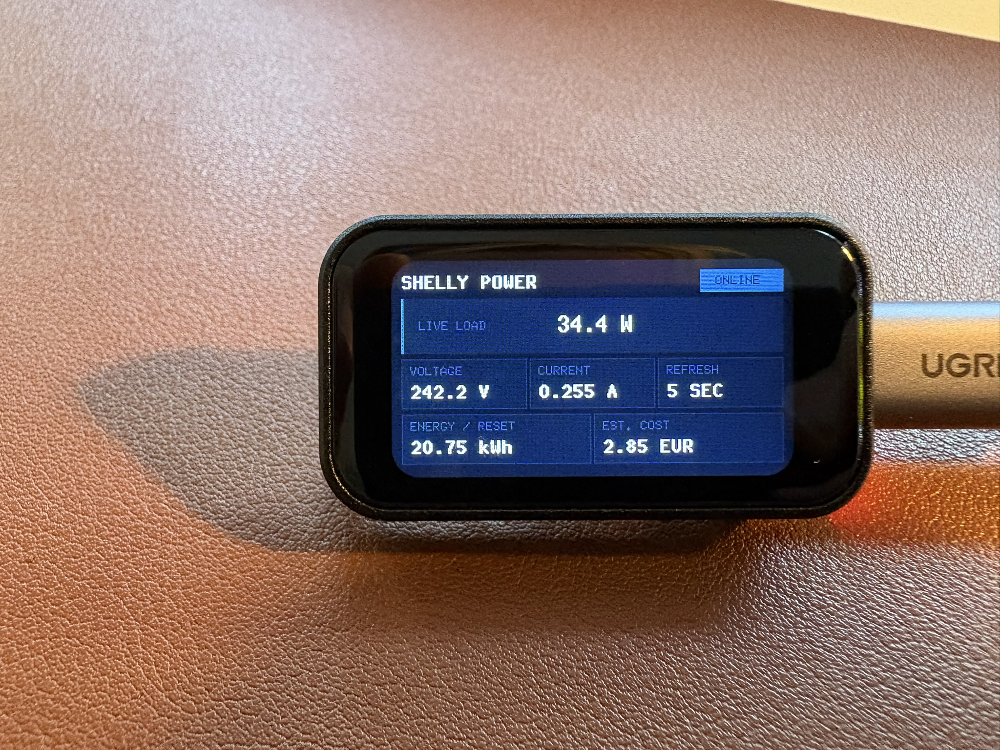

# Guillotine

[](https://github.com/mempirate/guillotine/actions/workflows/ci.yml)
[](https://crates.io/crates/guillotine)
[](https://docs.rs/guillotine)
[](https://deepwiki.com/mempirate/guillotine)

A `no-std` graphical user interface framework for embedded devices prioritizing resource efficiency and ergonomics. The UI declaration API is heavily inspired by [GPUI](https://github.com/zed-industries/zed/tree/main/crates/gpui).

Works everywhere `embedded-graphics` works.

## Demo

A demo Guillotine UI on a Waveshare ESP32-C6 1.47" LCD board from the [`shellyctl`](https://github.com/mempirate/shellyctl) project:



## Quickstart

```rust,no_run
use embedded_graphics::{
    prelude::*, 
    mock_display::MockDisplay, 
    pixelcolor::Rgb565,
    mono_font::ascii::FONT_9X18_BOLD,
};

use guillotine::*; 

struct BasicView {
    greeting: &'static str,
}

impl Render for BasicView {
    // Render lets you declaratively build your UI tree.
    fn render(&self, cx: &Context<'_>) -> impl ElementBuilder {
        cx.column()
            .padding(10)
            .margin(10)
            .border(2)
            .border_color(Rgb565::BLUE)
            .child(cx.text(self.greeting).background(Rgb565::RED).margin(5))
            .child(cx.text("GUILLOTINE").margin(5).font(Font::mono(&FONT_9X18_BOLD)))
    }
}

fn main() {
    // Display should implement embedded_graphics DrawTarget
    let display = MockDisplay::<Rgb565>::new();

    let view = BasicView {
        greeting: "Hello world!"
    };

    let storage = FrameStorage::<Rgb565>::default();
    let mut ui = Ui::new(display, storage);

    // Render the view
    ui.render(&view);
}

```

## Core Concepts

### Declarative Definition
- Explain the idea of declaratively building your UI

Status: implemented ✅

### Hybrid Immediate & Retained Mode

Status: unimplemented ❌

### Similar tree-based layout to X
- GPUI

Status: implemented ✅

### State Management

### Layout Engine
- Conceptually similar to Flutter (i.e. constraints go down, sizes go up)
  - constraints flow downward, sizes flow upward, positions flow downward
- Requirement: single pass.

Status: implemented ✅

## API

```rust,no_run
use embedded_graphics::{prelude::*, mock_display::MockDisplay, pixelcolor::Rgb565};

use guillotine::*;

struct Home {
    show_button: bool,
    header: &'static str,
}

impl Render for Home {
    fn render(&self, cx: &Context<'_>) -> impl ElementBuilder {
        cx.row()
            .bg(Rgb565::RED)
            .child(cx.text(self.header))
            .when(self.show_button, |row| row.child(cx.text("Click me")))
            .children([cx.text("Copyright"), cx.text("ACME Corp")])
    }
}

struct Page {
    power: &'static str,
    current: &'static str,
    voltage: &'static str,
}

impl Render for Page {
    fn render(&self, cx: &Context<'_>) -> impl ElementBuilder {
        cx.column()
            .child(cx.text(self.power))
            .child(cx.text(self.current))
            .child(cx.text(self.voltage))
    }
}

fn main() {
    let display = MockDisplay::<Rgb565>::new();

    let storage = FrameStorage::<Rgb565>::default();
    let mut ui = Ui::new(display, storage);

    let mut home = Home {
        show_button: false,
        header: "Some Title",
    };

    ui.render(&home).unwrap();

    home.show_button = true;

    ui.render(&home).unwrap();

    let page = Page {
        power: "Power: 50.0 W",
        voltage: "Voltage: 230.0 V",
        current: "Current: 0.2173 A",
    };

    ui.render(&page);
}
```

Element trees use the display's `PixelColor` type throughout. `Rgb565` views keep the API shown
above; other targets select their color once at the `Render<Color>` boundary, after which element
constructors and style methods infer it. See the [binary-color example](examples/binary.rs).

### Insets and the box model

Margin, padding, and border widths accept CSS-like physical-edge shorthands:

```rust,ignore
cx.column()
    .margin(10)                 // all edges
    .padding((4, 8))            // vertical, horizontal
    .border((1, 2, 3))          // top, horizontal, bottom
    .margin((4, 8, 12, 16));    // top, right, bottom, left
```

Use `Insets::new(top, right, bottom, left)` when a named value is clearer. Insets are non-negative
pixel lengths. Guillotine doesn't currently support percentages, `auto`, logical edges, negative
margins, margin collapsing, per-edge border colors, or border styles. Adjacent margins in rows and
columns add together.

`Style::size` is the border-box size: padding and border are placed inside it, and margin is added
outside it. The box grows to contain its padding and border when parent constraints allow.

### Examples

To run the examples, you need to enable the `simulator` feature. This pulls in a bundled [sdl2](https://github.com/Rust-SDL2/rust-sdl2) for opening windows. You will need cmake to compile it.

```sh
cargo run --example power_monitor --features simulator
```

## Roadmap

### v0.0.1
- [x] Try to mimic GPUI declaration style: <https://github.com/zed-industries/zed/blob/main/crates/gpui/examples/hello_world.rs>
- [x] Low-level `Element` / `ParentElement` trait for custom elements and widgets
- [x] Support generic `PixelColor`
- [x] Full immediate mode redrawing
- [ ] Make repo ready for publishing:
  - [ ] README documentation (a la Dioxus)
  - [x] Rustdoc documentation
  - [x] Examples
    - Sizing (insets)
    - Fonts
    - Cool
    - ESP32
  - [x] Fix exports
  - [x] Dual Apache / MIT license
  - [x] Fix sdl2 vendoring for embedded-graphics-simulator
- [x] `TextStyle` fonts
- [x] Support for non-interactive elements:
  - [x] Row
  - [x] (formatted) Text
  - [x] Column

### v0.1.0
- [ ] Add memory usage for examples
  - cargo binutils for examples in CI (cargo size). This will detect regressions.
- [x] No alloc
- [ ] Benchmarks for Frame building
- [ ] Container gaps (flex from CSS)
- [ ] Custom render modes feature: `incremental`. Turned on by default. Will use more memory to manage tree in between frames.
- [ ] Define inremental redrawing triggers / states:
```rs
enum DrawState {
    Clean,
    Paint,     // same geometry; repaint old/current bounds
    Layout,    // size or position changed
    Structure, // child added, removed, moved, or keyed differently
    Full,      // theme, rotation, display reset, etc.
}
```
- [ ] New elements
  - [ ] Dialogs / Modals (floating containers)
  - [ ] Charts
  - [ ] Spinner
- [ ] Overflow behaviour:
  - [x] Visible
  - [ ] Clip
- [ ] `profile` feature with `defmt` logs
- [ ] Custom elements
- [ ] Alignment
- [ ] Support for interaction
- [ ] Support interactive elements:
  - [ ] Button
  - [ ] Slider

## Why?

I was trying to build a clean-looking dashboard on a small LCD screen powered by an ESP32-C6, that's supposed to monitor and display the power consumption of my home lab (project [here](https://github.com/mempirate/shellyctl)). I wanted to do this in Rust, with the esp-rs ecosystem. The ecosystem is quite mature, but I couldn't really find a UI framework that was:
1. Performant
2. Very low memory footprint (no Slint / LVGL)
3. Beautiful

Additionally, I wanted to learn what it would take to build something like this.

## Prior Work & Inspiration
- [Clay by Nic Barker](https://github.com/nicbarker/clay#retained-mode-rendering)
- [Kolibri by Yandrik](https://github.com/Yandrik/kolibri)
- [GPUI by Zed](https://github.com/zed-industries/zed/tree/main/crates/gpui)
